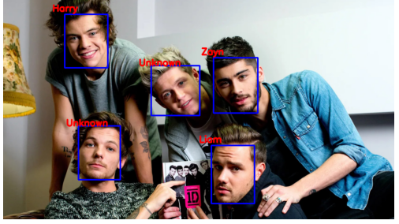

### This project consists of three parts :  
#### 1 - Face Verification :  
This part contains code for comparing two images of faces using the InsightFace library. The goal is to determine whether the two images belong to the same person or not.  
  

### How to Install 
```
pip install -r requirements.txt
```    
For face verification, run the following command : 

```
python face_verification.py --image1 images/image1.jpg --image2 images/image2.jpg
```
#### 2 - Face Identification :  
In this section, face identification is implemented :  
  
First of all it's needed to create a face_bank, a .npy file containing name and the 512D feature vector of each person.  
You can add new feature vector by putting your images in face_bank folder and running the following command :  
```
python face_identification.py --update 
```  
##### This is the result after updating (Liam has been added) :
  

It will update the face bank and new faces will be identified.  
You can also run the following command to identify faces on your own image:  
```
python face_identification --update --image input/YOUR_IMAGE
```  

#### 3 - Smart Webacm :  
 This implementation in FaceID folder, features real-time face identification using a webcam. The system detects faces in the webcam feed and attempts to identify the person. If the face is successfully identified, the user gains access to a hand-painting program. Otherwise, an "Access Denied!" message is displayed.  
 To use the AI paint, run the following command in FaceID folder path :  
 ```
 python AIPaint.py
 ```


